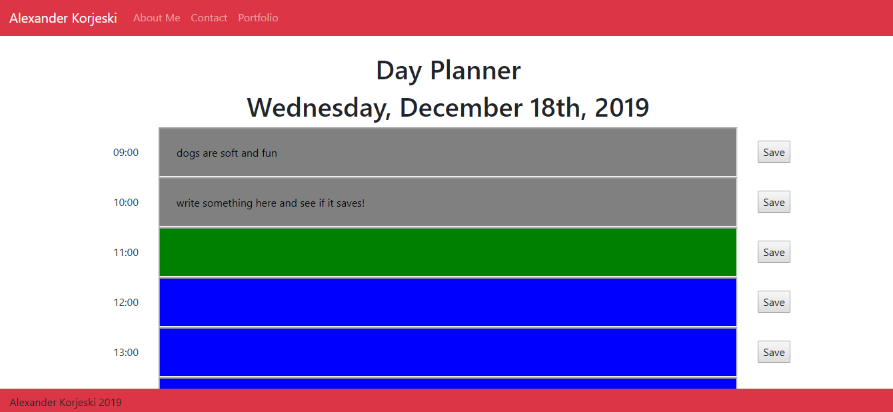

# dayplanner
This is a dynamic day planner.

On page load, you will be presented with the current date and timeslots for every business hour (9am-5pm)

These timeslots are color coded. The current hour is GREEN, anything in the past is GRAY and future timeslots are BLUE.

Click on these timeslots will allow you to edit&save the timeslots using local storage.

